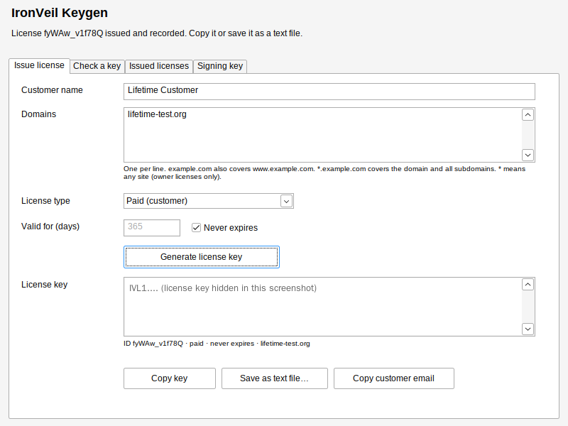

# IronVeil Keygen (Windows)

IronVeil Keygen is the plugin owner's desktop app for IronVeil Security Pro licenses. It runs on Windows and lets you:

- **Issue** Pro license keys that the plugin accepts. The format is the same as `tools/ironveil-license.php`.
- **Check** any key: is it genuine, who it was issued to, which domains it covers, and whether it has expired or been revoked.
- **Keep a log** of every license you issue, and export it to CSV.
- **Revoke** licenses and **sign the revocation feed** (`signatures.json`) that sites download, with no PHP and no unencrypted key file.
- **Protect the owner signing key** in an encrypted keystore. You can also create a new key pair if the old one is ever lost or exposed.

The app is fully offline: it never connects to the internet. It is a single `.exe` with no installer and no runtime dependencies, and runs on Windows 10/11 (x64 and ARM64).



---

## 1. Download and verify

The prebuilt executables are in [`dist/`](dist/):

| File | For |
|---|---|
| `IronVeil-Keygen-1.0.0-windows-amd64.exe` | Most Windows PCs (Intel/AMD 64-bit) |
| `IronVeil-Keygen-1.0.0-windows-arm64.exe` | Windows on ARM (Surface Pro X/11, Snapdragon laptops) |

Before the first run, check that the file matches `dist/SHA256SUMS.txt`:

```powershell
Get-FileHash .\IronVeil-Keygen-1.0.0-windows-amd64.exe -Algorithm SHA256
```

The build is reproducible: building the same commit with `build.sh` or `build.ps1` gives byte-identical files. You can therefore rebuild it yourself instead of trusting the binary (see section 8).

The executable is not code-signed yet, so Windows SmartScreen may say "Windows protected your PC". Click **More info → Run anyway** only after the hash matches. Section 9 explains how to sign it.

## 2. First-time setup: protect your owner key

You need the owner kit's `ironveil-owner-private.key` once.

1. Start the app and open the **Signing key** tab.
2. Click **Open key file…** and choose `ironveil-owner-private.key`.
3. The app warns that the file is **not encrypted**. Click **Yes** to save an encrypted copy.
4. Choose where to save the keystore, for example `Documents\IronVeil\ironveil-owner.ivkey`. Then choose a passphrase twice:
   - at least 12 characters;
   - at least 5 different characters;
   - no leading or trailing spaces.

   A long phrase of several random words is ideal.
5. The status line now reads **"unlocked and matches the IronVeil Security plugin"**.
6. Move the unencrypted `ironveil-owner-private.key` to offline storage (for example an encrypted USB drive kept in a safe place) and delete it from the PC. From now on, use **Unlock last keystore**.

> **Back up the `.ivkey` file and remember the passphrase.** There is no recovery. Without the key you cannot issue licenses or publish feeds. You would have to create a new key pair, release a new plugin version and re-issue every license.

## 3. Issue a license

**Issue license** tab:

| Field | Meaning |
|---|---|
| Customer name | Shown in the plugin and in your log. Up to 100 characters; `<` and `>` are not allowed. |
| Domains | One per line (commas also work). `example.com` also covers `www.example.com`. `*.example.com` covers the domain and all its subdomains. `*` means any site and is allowed for owner licenses only. You can paste full URLs; the app keeps just the host. Non-ASCII domains must be entered in punycode (`xn--…`). Up to 50 domains. |
| License type | **Paid**, **Complimentary** (free gift) or **Owner** (your own sites). |
| Valid for (days) | 1–36500 days, or tick **Never expires**. |

Click **Generate license key**. The key appears together with its ID and summary, and is recorded in the issued-licenses log. Then:

- **Copy key** puts only the key on the clipboard.
- **Copy customer email** copies a ready-to-send message with the key, domains, expiry and activation steps.
- **Save as text file…** saves that message as a `.txt` file.

The customer pastes the key in **WordPress → IronVeil → Upgrade to Pro → Activate Pro**.

## 4. Check a key

**Check a key** tab: paste any key, and optionally enter the site's domain or URL, then click **Check key**. You'll see one of:

- **Valid:** the plugin will accept it, with the customer, type, domains, issue date, expiry and license ID.
- **Genuine, but not valid for this domain**, or **expired**.
- **Signature check FAILED:** the key was forged, altered or signed with another key. Nothing inside it can be trusted.
- **Not a valid IronVeil license key:** malformed input.

If your log marks the key as revoked, the result says so. Checking keys works without unlocking the signing key.

## 5. Issued licenses and revocation

The **Issued licenses** tab lists every license this PC has issued, with its status: Active, Expired or Revoked.

- **Copy selected key:** copies the full key of the highlighted row, for example to resend it to a customer.
- **Export CSV…:** exports the list for accounting. **Keys are not exported.** Cells that start with `= + - @` are prefixed with `'` to prevent formula injection in Excel.

**To revoke a license** (for example after a refund or a leaked key):

1. Tick the license(s) and click **Revoke checked…**.
2. Click **Sign revocation feed…**.
3. Choose your feed **rules file** (`rules.json`, in the format of `ironveil-security/tools/feed-example.json`). **Raise its `"version"` number every time you publish.**
4. Confirm the summary: rule counts, number of revoked licenses, and the feed's expiry (90 days unless the rules file sets `"expires"`).
5. Save `signatures.json` and upload it to your feed URL: `License::DEFAULT_FEED_URL`, or whatever the sites use.

Every revoked ID in your log is merged in automatically. The whole rule set is kept, because the plugin replaces its feed state with each feed it installs. Pro sites download the feed daily; a revoked key then drops to Free. The plugin checks feeds against the owner public key, so sign them with the same key that issues licenses. Re-sign and upload the feed at least every 90 days, or sites stop accepting it as stale.

The app checks the rules file the same way the plugin does, and refuses to sign when it finds:

- an invalid rule id or severity;
- a missing description;
- a pattern that is too long, unbalanced, or uses control verbs, callouts, back-references or named groups;
- an invalid license ID;
- more than 3000 rules.

The plugin also compiles every pattern with PCRE and skips any that fail.

## 6. Signing key tab

| Button | What it does |
|---|---|
| Open key file… | Opens an encrypted `.ivkey` (asks for the passphrase) or an unencrypted owner-kit `.key` (offers to save an encrypted copy). |
| Unlock last keystore | Re-opens the keystore you used last. |
| Save encrypted copy… | Writes the unlocked key to a **new** `.ivkey` with a new passphrase, for example to change the passphrase or make a backup. It never overwrites a file. |
| Lock now | Wipes the key from memory. |
| Create new key pair… | **Only if the owner key was lost or exposed.** Generates a new Ed25519 key pair, saves it encrypted and copies the new public key to the clipboard. Sites reject licenses and feeds from the new key until you:<br>1. put the public key in `includes/class-license.php` → `PUBLIC_KEY`;<br>2. run `php tools/build-checksums.php`;<br>3. release the plugin.<br>Once sites run that release, licenses from the old key stop working, so re-issue them. |
| Open data folder | Opens `%AppData%\IronVeil Keygen`. |

The key locks automatically after **10 minutes without keyboard or mouse input**, and whenever **Windows locks** (Win+L, sleep, switching user).

**Data folder** (`%AppData%\IronVeil Keygen`, readable only by your Windows account):

- `issued-licenses.jsonl` is the license log, one JSON record per line. It includes the full keys so you can resend them. Back it up together with the keystore.
- `settings.json` holds the path of the last keystore. No secrets are stored there.

## 7. Security design

**Cryptography**
- Licenses are Ed25519 signatures over the exact JSON payload (`IVL1.<payload>.<signature>`, base64url), identical to the PHP tool. The plugin's built-in public key is compiled in, so the app can tell whether a loaded key really matches the plugin.
- After signing, every issued key is verified against its own payload, and the app refuses to show a key that fails.
- License IDs are 72 random bits from the OS CSPRNG. Issuing fails closed if randomness is unavailable.

**Keystore (`.ivkey`)**
- **Argon2id** derives the key: 4 passes, 256 MiB, 4 lanes, 32-byte random salt. That is about 1–2 s per attempt on a typical PC, and costly to brute-force on GPUs.
- **XChaCha20-Poly1305** encrypts it, with a random 192-bit nonce.
- Every header field (format, version, KDF parameters, salt, cipher, public key) is bound into the AEAD as associated data, so editing any of them makes the file fail to open.
- When opening, the KDF parameters must be within fixed bounds: time 2–20, memory 64 MiB–2 GiB, threads 1–16. A crafted file therefore cannot downgrade the protection or exhaust memory.
- Unknown JSON fields are rejected, files over 64 KiB are refused, and the decrypted key must match the stored public key.
- A wrong passphrase and a tampered file give the same error, and a wrong passphrase costs an extra delay.
- Each new keystore is test-opened before it is written. Writes are atomic (temp file → `fsync` → link) and never overwrite an existing file.

**Memory and clipboard**
- The private key, passphrases and decrypted bytes are zeroed after use. Text read from password fields is converted without leaving copies in Go strings.
- Background work (Argon2id) seals its own copy of the key, so an auto-lock during an operation can never corrupt it. The lock is applied as soon as the operation finishes.
- Clipboard writes ask Windows to keep the data out of **clipboard history** and **cloud clipboard sync**, and to exclude it from clipboard monitors.

**Files and process**
- The keystore, the log and the data folder get a **protected DACL granting access only to your Windows account**: no inherited ACEs, no Users or Everyone access.
- DLLs load **only from System32** (`SetDefaultDllDirectories`), which blocks DLL planting next to the exe or in the working folder.
- These process mitigations are enabled: strict handle checks, Win32k extension points disabled (no AppInit DLLs), and no images loaded from remote shares or low-integrity files.
- The PE image has ASLR (high-entropy, 64-bit), DEP/NX and the GUI subsystem. The manifest requests `asInvoker` (no admin rights) and per-monitor DPI awareness.
- Pure Go (memory-safe), with no cgo and no third-party GUI framework. The only dependencies are `golang.org/x/crypto` and `golang.org/x/sys`.
- No network code at all.

**Threat model**

| Threat | Protection |
|---|---|
| Someone copies the keystore file (backup leak, stolen laptop, malware that grabs files) | Encrypted with a memory-hard KDF. Security then rests on passphrase strength, which the passphrase policy enforces. |
| Another Windows user on the same PC | Owner-only ACLs on the keystore, log and data folder. |
| Someone at an unlocked, unattended PC | Auto-lock after 10 minutes idle and when Windows locks. |
| Clipboard history or sync leaking keys | History and cloud-sync exclusion formats on every copy. |
| Malicious DLL next to the exe or in the download folder | System32-only DLL search order and image-load restrictions. |
| Crafted `.ivkey`, license key, rules file or log file | Strict parsers with size limits; fuzz-tested (see below). |
| Forged or altered license keys or feeds | Ed25519 signature checks, the same as the plugin's. |

Out of scope: malware already running **as your user, or as admin, while the key is unlocked**. Such malware can read process memory or log keystrokes, and no desktop app can stop it. Use the keygen on a clean, up-to-date PC, ideally a dedicated or offline one, and keep the keystore locked when you are not issuing licenses.

## 8. Build from source

You need Go 1.26 or newer (the module pins toolchain go1.27.1; `go` downloads it automatically).

```powershell
# Windows
powershell -ExecutionPolicy Bypass -File .\build.ps1
```

```bash
# Linux/macOS (cross-compiles for Windows)
./build.sh
```

Both scripts run `gofmt`, `go vet` and all tests, then write `dist/IronVeil-Keygen-<version>-windows-{amd64,arm64}.exe` and `dist/SHA256SUMS.txt`. Set `VERSION=1.0.1` to change the version string.

The icon and manifest live in `winres/` and are compiled into `cmd/ironveil-keygen/rsrc_windows_*.syso`. After changing them, regenerate with:

```bash
go run github.com/tc-hib/go-winres@v0.3.3 make --in winres/winres.json --out cmd/ironveil-keygen/rsrc --arch amd64,arm64
```

Project layout:

```
cmd/ironveil-keygen/   Win32 GUI (raw Win32 API via golang.org/x/sys/windows)
internal/license/      license format: issue, verify, domain rules (mirrors includes/class-license.php)
internal/keystore/     encrypted keystore, owner-kit import, owner-only ACLs, atomic writes
internal/feed/         signature-feed signing and verification (mirrors tools/ironveil-sign.php)
internal/ledger/       issued-licenses log and CSV export
```

**Tests and checks** run for this release:
- `go test -race ./...`: all packages pass.
- Cross-implementation tests: a license and a feed signed by the plugin's PHP tools verify in Go. Keys and feeds issued by the app verify in the plugin's own `License::verify` and `Signature_Feed::install`, including revocation of an app-issued key and rejection of a tampered feed.
- Tests compiled for Windows (`GOOS=windows go test -c`) pass under Wine, and the security descriptor the app applies is checked: protected, a single ACE, current user only. The test that reads the DACL back from disk only runs on real Windows, because Wine does not store file ACLs. Run `go test ./...` on a Windows PC to execute it.
- Fuzzing found no crashes: `FuzzVerify` (license keys), `FuzzOpen` (keystore files), `FuzzSign` (rules files) and `FuzzRead` (log files, including CSV formula-injection checks).
- `go vet` and `staticcheck` (all checks) are clean for Windows and Linux. `gosec` is clean apart from G103/G115, which are inherent to raw Win32 calls: `unsafe` pointer arguments and integer conversions required by the Win32 ABI.

`internal/license/testdata/test-only.key` is a throwaway test key pair. It is **not** the owner key and cannot create licenses the plugin accepts.

## 9. Code signing (recommended before giving the app to anyone else)

Unsigned executables trigger SmartScreen warnings, and users cannot tell a genuine copy from a tampered one. To sign:

1. Get a code-signing certificate. An OV/EV certificate from a CA, or **Azure Trusted Signing**, is the cheapest option that SmartScreen trusts.
2. Sign and timestamp both executables with SHA-256:

   ```powershell
   signtool sign /fd SHA256 /tr http://timestamp.digicert.com /td SHA256 /a dist\IronVeil-Keygen-1.0.0-windows-*.exe
   signtool verify /pa /v dist\IronVeil-Keygen-1.0.0-windows-amd64.exe
   ```
3. Regenerate `SHA256SUMS.txt`: signing changes the hashes.

## 10. Troubleshooting

| Problem | Fix |
|---|---|
| "Wrong passphrase, or the keystore file was altered" | Check Caps Lock and the keyboard layout. If the passphrase is definitely right, restore the keystore from your backup. |
| "Does NOT match the public key built into the plugin" | You opened a different key, such as a test key or a new key pair. Licenses signed with it are rejected unless the plugin's `PUBLIC_KEY` is changed. |
| The customer's key says "not valid for this domain" | Check the exact host the site runs on. `shop.example.com` needs `*.example.com` or its own entry. |
| A site still shows Pro after revocation | Confirm that `signatures.json` was uploaded to the feed URL with a **higher version**. Sites update daily; the site admin can also force an update from the Scanner page. |
| A file dialog does not open | The app reports the Windows error code. Make sure the folder exists and you have access to it. |
